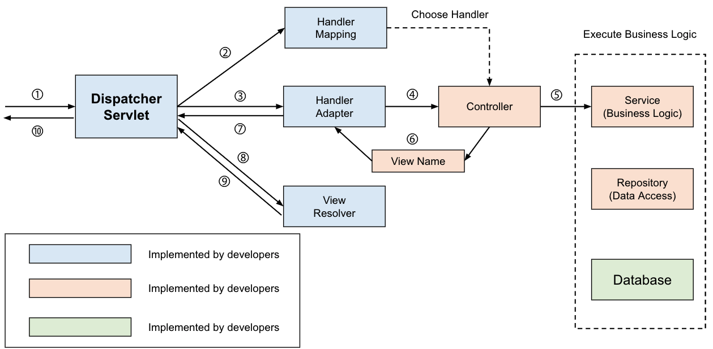
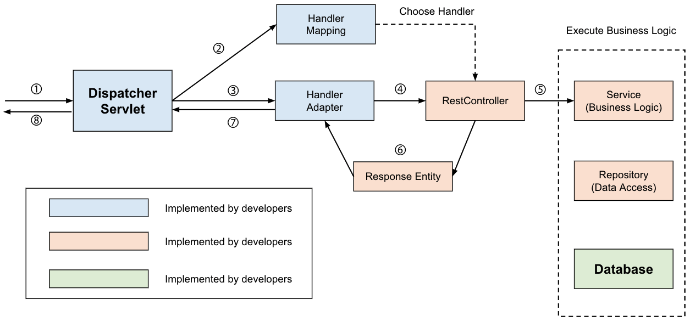

# @Controller vs @RestController
* @Controller와 @RestController 둘 다 스프링에서 Controller를 지정해주기 위한 어노테이션으로 사용된다.
* 둘의 주요한 차이점은 ResponseBody가 생성되는 방식인데 하나씩 알아가보자.

## 1. @Controller
   * @Controller 어노테이션은 Spring MVC의 전통적인 컨트롤러 어노테이션이다.
   * 기본적으로는 다음과 같은 시퀀스로 View를 반환한다.
   

   * 컨트롤러는 받은 요청을 처리 후 지정된 ViewName을 반환하는데 DispatcherServlet은 ViewResolver를 통해 해당하는 View를 찾아서 반환해준다.
## 2. @RestController
   * @Controller와 @RestController가 합쳐진 어노테이션으로 View가 아닌 Data를 반환한다.
   
   * 일반적으로 JSON형태의 데이터(객체)를 반환하고 주로 ResponseEntity를 생성하고 필요한 데이터를 헤더/쿠키/바디 등에 적절하게 배치해서 반환해준다.
   
## 🧐 @Controller에서 데이터(객체)를 반환할 수 있나요?
   * @ResponseBody 어노테이션으로 Data를 반환할 수 있다.
   * @Controller를 통해 객체(데이터)를 반환할 때 일반적으로 위 예제 코드처럼 ResponseEntity로 감싸서 반환한다.
   * 이 때, viewResolver대신 HttpMessageConverter가 동작하는데, 내부에 여러가지 데이터 타입에 따른 Converter를 사용해 처리된다.
   ```java
   @Controller
public class MyController {
    ...
    @GetMapping("/get")
    public @ResponseBody ResponseEntity<Data> getData() {
        return ResponseEntity.ok(myService.getData());
    }
    ...
}
   ```