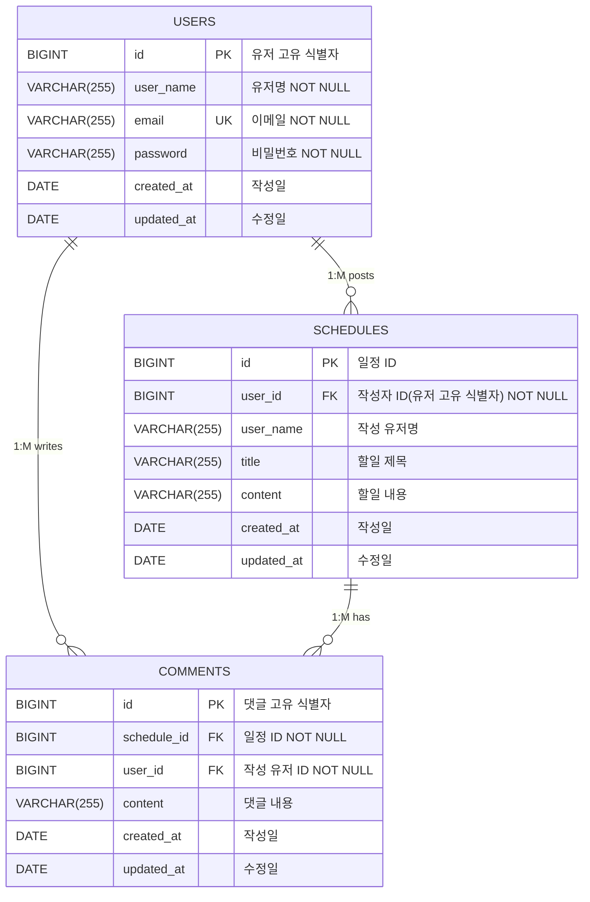
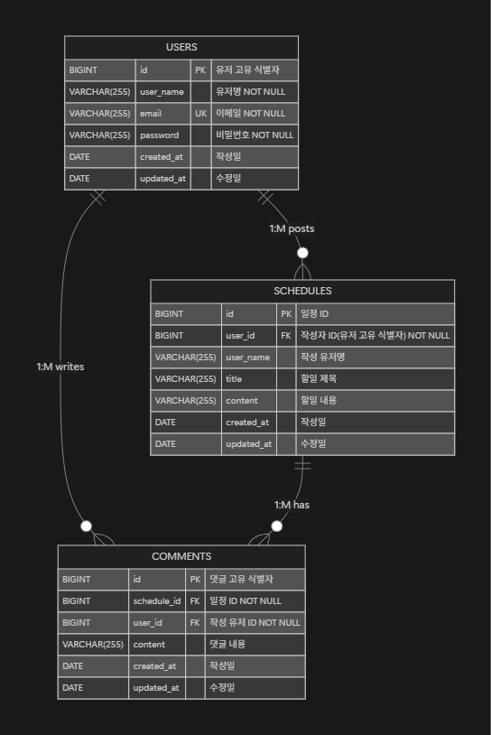

# ERD (USERS–SCHEDULES–COMMENTS)

```mermaid
erDiagram
    %% 왼쪽–오른쪽의 기수성과 선택성
    %% Cardinality(기수성): 카디널리티는 전체 행에 대한 특정 컬럼의 중복 수치를 나타내는 지표이다.
			  %% 해당 엔티티 1건에 대한 상대 엔티티의 중복도를 상대 엔티티에 표기.
		    %% 1대1, 1대다, 다대다 관계
		    %% 중복도가 ‘낮으면’ 카디널리티가 ‘높다’고 표현한다.
				%% 중복도가 ‘높으면’ 카디널리티가 ‘낮다’고 표현한다.
    %% Optionality(선택성): 사용자는 댓글을 작성하지 않을 수도 있다(optional),
		    %% 단 각 댓글은 반드시 그 댓글을 쓴 사용자가 있다(mandatory)
		    %% 1:0 Optional 선택 관계, 1:1 Mandatory 필수 관계
    
    %% 연관 관계
    USERS ||--o{ SCHEDULES : "1:M posts"
    USERS ||--o{ COMMENTS : "1:M writes"
    SCHEDULES ||--o{ COMMENTS : "1:M has"
    
    %% 기호 설명
		%% || = 정확히 1 (mandatory one)
    %% o| = 0 또는 1 (optional one)
    %% |{ = 1 이상 (one or many)
    %% o{ = 0 이상 (zero or many)
		
		%% 연관 관계 설명 - 라벨??
		%% posts : 유저가 일정을 게시한다. - 한 유저가 여러 일정을 게시한다.
		%% writes : 유저가 댓글을 작성한다. - 한 유저가 여러 댓글을 작성한다.
		%% has : 일정이 댓글을 가진다. - 한 일정에는 여러 댓글을 가진다.
		
		%% 유저
    USERS {
        BIGINT       id          PK "유저 고유 식별자"
        VARCHAR(255) user_name      "유저명 NOT NULL"
        
        VARCHAR(255) email       UK "이메일 NOT NULL"
        VARCHAR(255) password       "비밀번호 NOT NULL"
        DATE         created_at     "작성일"
        DATE         updated_at     "수정일"
    }
		
		%% 일정
		SCHEDULES {
        BIGINT       id        PK "일정 ID"
        BIGINT       user_id   FK "작성자 ID(유저 고유 식별자) NOT NULL"
        VARCHAR(255) user_name    "작성 유저명"
        VARCHAR(255) title        "할일 제목"
        VARCHAR(255) content      "할일 내용"
        DATE         created_at   "작성일"
        DATE         updated_at   "수정일"
    }
    
    %% 댓글
    COMMENTS { 
			  BIGINT       id           PK "댓글 고유 식별자"
        BIGINT       schedule_id  FK "일정 ID NOT NULL"
        BIGINT       user_id      FK "작성 유저 ID NOT NULL"
        VARCHAR(255) content         "댓글 내용"
        DATE         created_at      "작성일"
        DATE         updated_at      "수정일"
    }
    %% DATE : 날짜(연도, 월, 일) 형태의 기간 표현 데이터 타입(3byte)
    %% TIME : 시간(시, 분, 초) 형태의 기간 표현 데이터 타입(3byte)
    %% DATETIME : 날짜와 시간 형태의 기간 표현 데이터 타입(8byte)
    %% TIMESTAMP : 날짜와 시간 형태의 기간 표현 데이터 타입(4byte)-시스템 변경 시 자동으로 그 날짜와 시간이 저장된다
```

